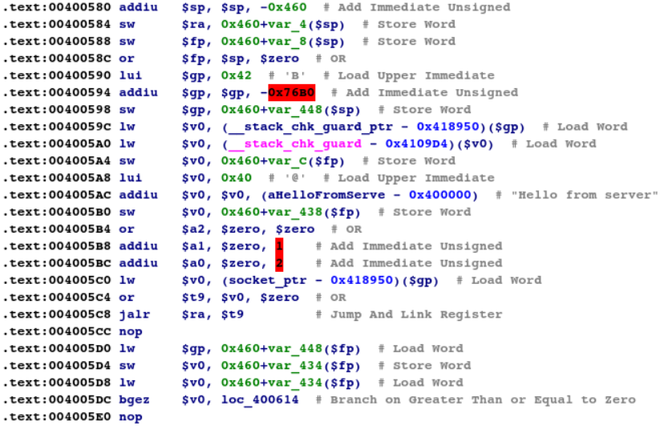
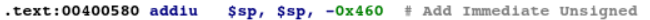
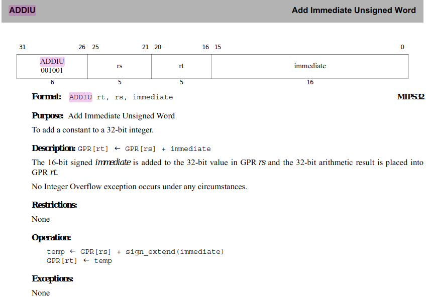
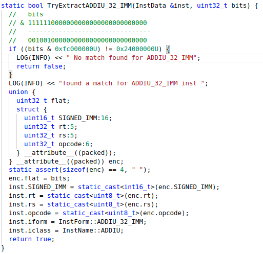
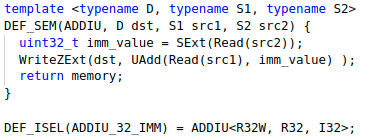
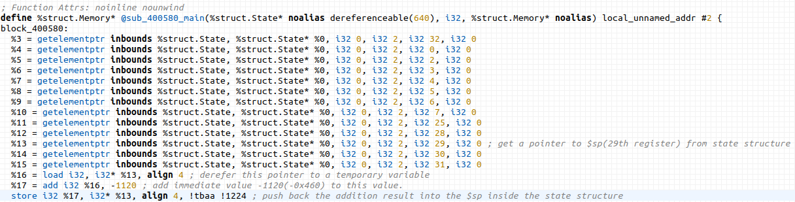
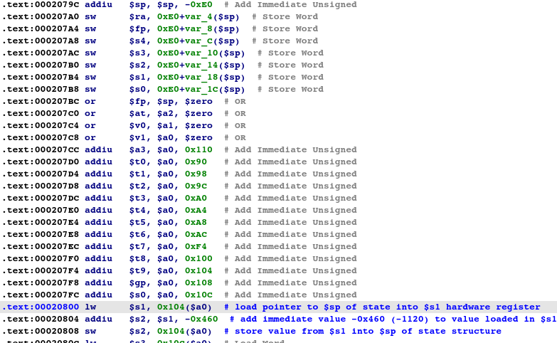

# Life of an instruction
In this document, we will describe the life of an instruction i.e., the complete cycle of compiling, lifting and recompiling for a single instruction.Here we are considering udp_server binary. These binary compiled using gcc mipsel cross-compiler and recompiled using clang compiler.

### Inside the binary

In a compiled binary, a garden variety of functions and basic blocks are present. Here we are considering basic block inside main function:


Let's focus on just **addiu** for now



Here, the instruction contains 
1 opcode (addiu)
3 operands (2 registers and 1 immediate)

The lifting process of **binary to IR** happends in two steps.
The first step is to recover the control flow graph and other is disassmeb it's information from the binary, and store it in a serialized format.

The format is defined using protocl buffer and for a single instruction, the defined format looks like:
```
// An instruction inside of a block.
message Instruction {
  required  int64           ea = 1;
  required  bytes           bytes = 2;
  repeated  CodeReference   xrefs = 3;
  optional  bool            local_noreturn = 4;

  // Address of the landing pad
  optional  uint64          lp_ea = 5;
  required  bool            has_ref_info = 6;
}
```

For now, focus only on 

- Effective Address(ea=1)
- Instruction bytes(bytes=2)

For the above mentioned instruction , what goes in the CFG is:
```
" you can also paste the capstone output"
Instruction {
 ea = 0x400580;
 bytes = "27 BD FB A0"
 }
```

Before moving onto the second step, let's discuss about **addiu**.
From the MIPS32 ISA specification:


To decode this Instruction, we use masking on the extracted bytes stored in the CFG file to obtain the various instruction fields.
In this case, namely: **register rt, register rs, 16 bit immediate**



Now going by ISA’s specification, the 16 bit value is sign-extended to 23 bits, added to the 32 bit value in register < rs > . The result is stored inside register < rt >.

Now, to emulate the same behaviour, we define this semantic behaviour of the instruction using C++ templates.


Immediate values can be passed as is, but for registers, a structure called ```state``` is defined, whose members are mnemonic names of the architecture/hardware registers.
All semantic functions operate on these state's register to emulate operation on hardware registers.

Let's compile this semantic function to LLVM IR (bitcode)

```
; Function Attrs: alwaysinline norecurse nounwind
define internal %struct.Memory* @_ZN12_GLOBAL__N_1L5ADDIUI3RnWIjE2RnIjE2InIjEEEP6MemoryS8_R5StateT_T0_T1_(%struct.Memory* readnone returned, %struct.State* nocapture readnone dereferenceable(640), i32* nocapture, i32, i32) #0 {
  %6 = add i32 %4, %3
  store i32 %6, i32* %2, align 4, !tbaa !7
  ret %struct.Memory* %0
}
```

Now for the second step of lifting, the disassembly information in CFG is read, and IR is generated accordingly

The general procedure is to generate a LLVM function for every function name in the CFG, then within the function, create a LLVM basic block for every Basic block in the CFG, and every instruction in a basic block is replaced with IR generated with it's semantic function. 

Lastly, some optimizations are performed on the bitcode, like

- inlining the call to the semantic functions
- aggresive dead code elimination.
- mem2reg promotion.

In the end, the finalized IR looks like:



so where is the addiu from the dissassmbly?
the semantic function simulates the semantic behaviour of an instructions. The actual LLVM instructions generated are totally up to the compiler.

**Let's compile this back to assembly. The resultant assembly looks like:**

```
your asm goes here
```

conclusion? that's how a single instruction in the original binary ends up being represented by multiple instructions, operating on the state structure, to simulate the same behaviour.
